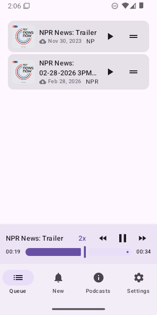
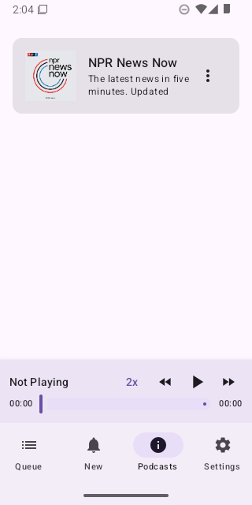
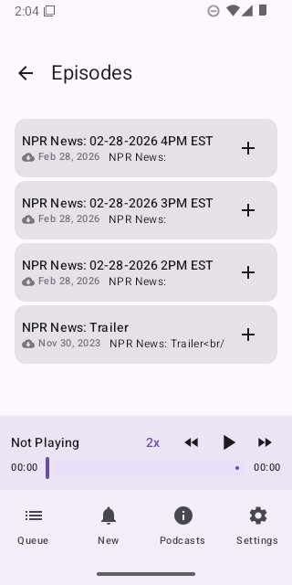
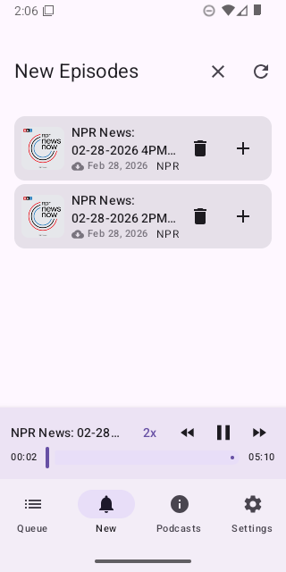
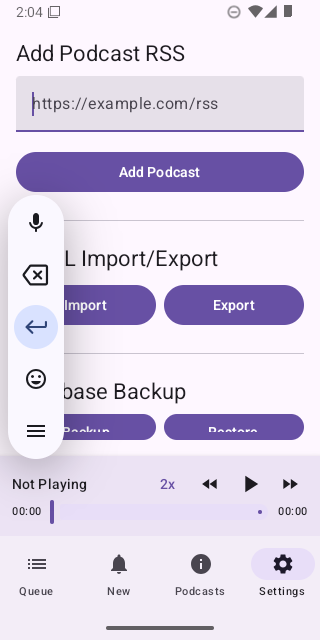

# Podcasts App

A fast, highly-optimized podcast player built for Android using modern Jetpack Compose, Media3, and Room.

## Features

*   **Unified Player UI:** A persistent, vertically compact media player available across all screens that displays the currently playing episode title and playback controls.
*   **High-Density Queue Management:** A dedicated, easily re-orderable listening queue. Native drag-and-drop support and swipe-to-dismiss functionality allow you to manage your playlist seamlessly.
*   **Background Playback:** Play podcasts while you multitask using other apps or when your screen is locked using a robust `MediaSessionService`.
*   **Speed Controls:** Adjust the playback speed to suit your listening style.
*   **Auto-Download:** Episodes can be queued for offline playback automatically via background WorkManager tasks.
*   **OPML Import/Export:** Import your existing subscriptions from other apps or export them for backup.

## Screenshots

  
  
  
  
  

## Permissions Explained

When you first open the application, it will ask for **Notification Permissions**.

### Why do we need this?
To allow podcasts to continue playing in the background (when you leave the app or turn off your screen), Android requires the application to run a special "Foreground Service." 

By Android's system rules, any app running this kind of persistent background service **must** display an ongoing notification (in our case, the media playback controls like Play, Pause, and Skip). Starting with Android 13, apps cannot show any notifications without explicitly asking for the `POST_NOTIFICATIONS` permission. If you deny this permission, Android might unexpectedly stop your podcast from playing as soon as you put the app in the background.

## Tech Stack

*   **UI:** Jetpack Compose (Material 3)
*   **Media Playback:** AndroidX Media3 (ExoPlayer & MediaSessionService)
*   **Architecture:** MVVM, Coroutines, Flow
*   **Dependency Injection:** Hilt
*   **Local Database:** Room
*   **Background Tasks:** WorkManager
*   **Network:** Retrofit, OkHttp
